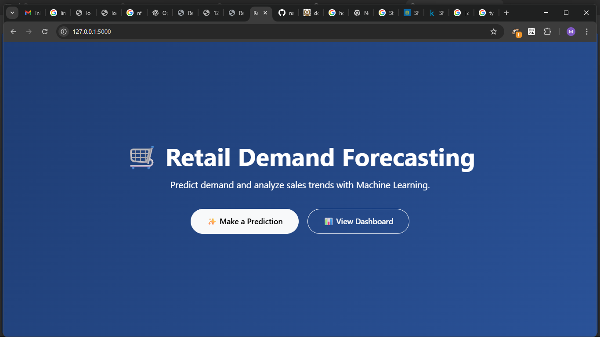
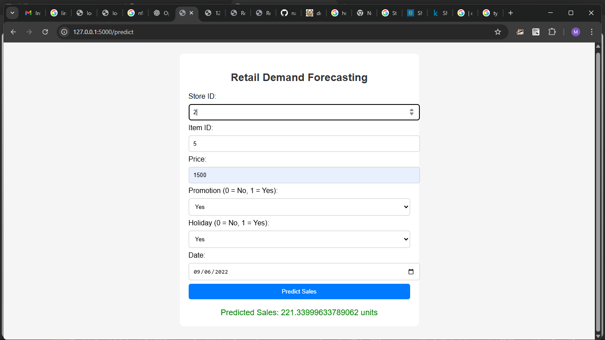
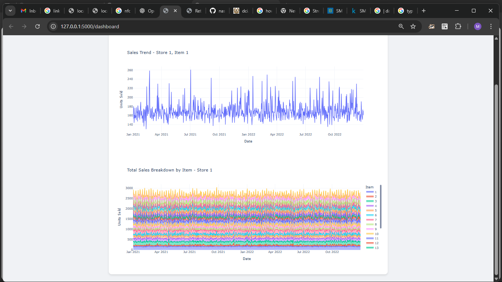

# 🛒 Retail Demand Forecasting

A Flask web app that predicts and visualizes retail sales using **Machine Learning (XGBoost + Scikit-learn)**.

[](https://www.python.org/)
[](https://flask.palletsprojects.com/)
[](https://scikit-learn.org/)
[](LICENSE)

---

## 🚀 Features
- ✨ Animated landing homepage
- 🔮 Demand prediction form (store, item, price, promo, holiday, date)
- 📊 Interactive dashboard (filters, charts, breakdowns)
- ⬇ Export filtered sales data as CSV
- Trained **ML model** for demand forecasting

---

## 📸 Screenshots

### 🏠 Home


### 🔮 Prediction Form


### 📊 Dashboard


---

## ⚡ Tech Stack
- **Backend**: Flask, Pandas, Scikit-learn, XGBoost
- **Frontend**: HTML, CSS, Bootstrap 5, Plotly
- **Environment**: Python 3.10+

---

## ▶️ Run Locally

```bash
# Clone repo
git clone https://github.com/nasseh98/retail-forecast.git
cd retail-forecast

# Create virtual environment
python -m venv venv
venv\Scripts\activate   # Windows

# Install dependencies
pip install -r requirements.txt

# Train model
python train_model.py

# Run app
python app.py


